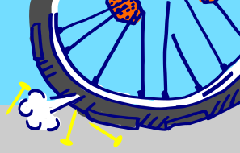

<h2>
L’atelier est ouvert 
tous les jeudis de 16h à 20h - Avenue de la Verrerie 23, 1190 Forest, Belgique. 
</h2>
 
 

	Et lors des ouvertures au quartier de Zonneklopper, 
	suivez-nous sur notre page pour connaître les événements auxquels nous participons : 
	https://www.facebook.com/atelierCyklopper/

	Les pièces neuves sont vendues à un prix démocratique 
	et les pièces d’occasion à prix libre (ce que tu veux, ce que tu peux

	Cyklopper est ouvert à tous.tes. 
	Chacun.e est le bienvenu.e dans notre atelier !

